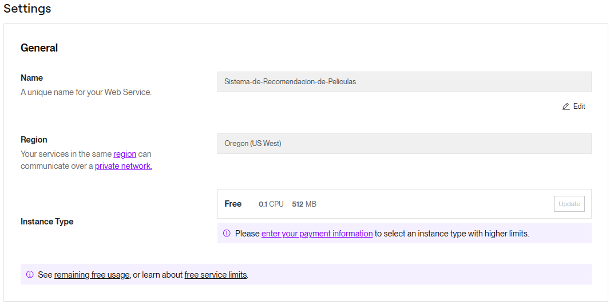
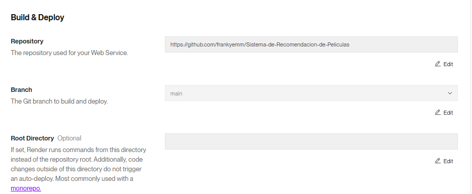
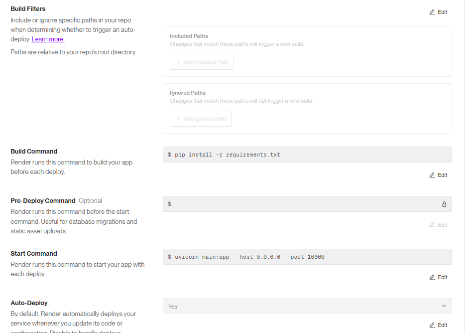

# Sistema de Recomendación de Películas

Este proyecto consiste en el desarrollo de un sistema de recomendación de películas, que permite a los usuarios obtener recomendaciones basadas en una película específica, así como acceder a diversas consultas sobre películas, actores y directores. El proyecto incluye una API implementada con FastAPI y desplegada en Render.com, facilitando el consumo de los datos para diferentes departamentos de la organización, como Analytics y Machine Learning.

## Estructura del Proyecto

- **`Modelo.ipynb`**: Contiene todos los pasos del EDA y ETL.
- **`models2.py`**: Contiene las funciones necesarias para realizar las consultas solicitadas por la API.
- **`main.py`**: Incluye las definiciones de los endpoints de la API, implementados con decoradores para ser utilizados con FastAPI.
- **`model.py`**: Almacena el modelo de recomendación original.
- **`sim.pkl`**: Una matriz de similitud serializada utilizada por el sistema de recomendación para calcular las recomendaciones de películas.
- **Deployment**: La API ha sido desplegada en Render.com para facilitar el acceso web.

## Preparación de Datos

### Datasets Utilizados

El proyecto se basa en dos datasets:
- `credits.csv`
- `movies_dataset.csv`

### Transformaciones Realizadas

1. **Desanidado de Campos**: Algunos campos como `belongs_to_collection` y `production_companies` son diccionarios o listas anidadas. Estos campos se desanidan para facilitar las consultas en la API.

2. **Manejo de Valores Nulos**:
   - Los valores nulos en `revenue` y `budget` se reemplazan por 0.
   - Los valores nulos en `release_date` se eliminan.

3. **Formato de Fechas**: Las fechas se convierten al formato `AAAA-MM-DD`. Además, se crea una columna `release_year` para almacenar solo el año de lanzamiento.

4. **Cálculo del Retorno de Inversión**: Se añade una columna `return`, calculada como la división de `revenue` entre `budget`. En los casos en los que no se puede calcular, se asigna el valor 0.

5. **Eliminación de Columnas Irrelevantes**: Se eliminan las columnas `video`, `imdb_id`, `adult`, `original_title`, `poster_path`, y `homepage` para reducir la complejidad del dataset.

## Funcionalidades de la API

La API, desarrollada con FastAPI, ofrece seis endpoints principales, además de un endpoint adicional para el sistema de recomendación.

### Endpoints Disponibles

1. **`cantidad_filmaciones_mes(mes)`**
   - Devuelve la cantidad de películas estrenadas en un mes específico (en español).
   - **Ejemplo**: "X cantidad de películas fueron estrenadas en el mes de X".

2. **`cantidad_filmaciones_dia(dia)`**
   - Devuelve la cantidad de películas estrenadas en un día específico de la semana (en español).
   - **Ejemplo**: "X cantidad de películas fueron estrenadas en los días X".

3. **`score_titulo(titulo_de_la_filmación)`**
   - Devuelve el título, año de estreno y score (popularidad) de una película específica.
   - **Ejemplo**: "La película X fue estrenada en el año X con un score/popularidad de X".

4. **`votos_titulo(titulo_de_la_filmación)`**
   - Devuelve el título, cantidad de votos y promedio de votación de una película. Solo se devuelve si la película tiene al menos 2000 valoraciones; de lo contrario, se muestra un mensaje indicando que no cumple esta condición.
   - **Ejemplo**: "La película X fue estrenada en el año X. La misma cuenta con un total de X valoraciones, con un promedio de X".

5. **`get_actor(nombre_actor)`**
   - Devuelve la cantidad de películas en las que ha participado un actor, el retorno total y el promedio de retorno por filmación.
   - **Ejemplo**: "El actor X ha participado de X cantidad de filmaciones, consiguiendo un retorno de X con un promedio de X por filmación".

6. **`get_director(nombre_director)`**
   - Devuelve las películas dirigidas por un director, junto con la fecha de lanzamiento, retorno individual, costo y ganancia de cada película.
   - **Ejemplo**: "El director X ha dirigido las siguientes películas: ...".

7. **`recomendacion(titulo)`**
   - Endpoint adicional que utiliza la matriz `sim.pkl` para recomendar películas similares basándose en el título ingresado. Devuelve una lista de las 5 películas con mayor similitud.

## Deployment

El proyecto ha sido desplegado en Render.com, lo que permite consumir la API desde la web de manera sencilla. Alternativamente, se podría desplegar en otros servicios como Railway, que ofrecen soporte para aplicaciones web y API.

## Análisis Exploratorio de Datos (EDA)

Antes de desarrollar el sistema de recomendación, se realizó un análisis exploratorio de datos (EDA) para identificar relaciones, patrones y posibles outliers. Entre las visualizaciones generadas, se incluyó una nube de palabras para observar la frecuencia de palabras en los títulos, lo cual resultó útil para el sistema de recomendación.

## Sistema de Recomendación

El sistema de recomendación está basado en la similitud entre películas. Utiliza la matriz `sim.pkl` para calcular la similitud entre la película ingresada y el resto de las películas en el dataset. Las películas se ordenan según su score de similitud, y se devuelven las 5 películas con mayor puntuación en orden descendente.

El sistema de recomendación está disponible como un endpoint adicional en la API, lo que permite a los usuarios obtener recomendaciones de películas similares basadas en una película específica.

## Dependencias

Este proyecto utiliza las siguientes librerías de Python:
- **FastAPI**: Para crear y manejar la API.
- **Scikit-learn**: Para el procesamiento de datos y cálculo de similitudes.
- **Pandas**: Para la manipulación y análisis de datos.
- **Uvicorn**: Para ejecutar el servidor ASGI compatible con FastAPI.

## Créditos

Este proyecto fue desarrollado con fines educativos y de aprendizaje en el campo de ciencia de datos y machine learning aplicado a recomendaciones de contenido.

## Licencia

Este proyecto se distribuye bajo la licencia MIT. Consulta el archivo `LICENSE` para más detalles.